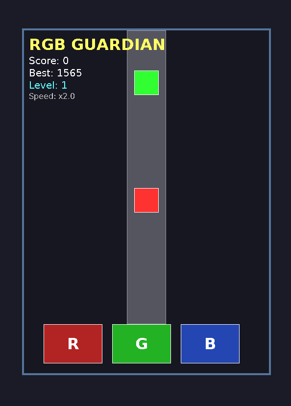

# 🎮 RGB Guardian

Fast-paced color-matching arcade game with progressive difficulty system.


---

## 🖼️ Screenshots



## 🎯 Quick Start

### Option 1: Docker (Recommended)

```bash
# Give execution permission
chmod +x run_with_docker

# Run the game
./run_with_docker
```

### Option 2: Native Build

```bash
# Install dependencies
sudo apt update
sudo apt install -y build-essential libsdl2-dev libsdl2-mixer-dev libsdl2-ttf-dev

# Build
make

# Run
make run
```

---

## 🎮 Controls

| Key | Action |
|-----|--------|
| `R` | Red dot |
| `G` | Green dot |
| `B` | Blue dot |
| `P` | Pause/Resume |
| `SPACE` | Restart (after game over) |
| `ESC` | Exit |

---

## 🔊 Sound Setup (Optional)

Generate sound effects:

```bash
chmod +x generate_sounds.sh
./generate_sounds.sh
```

Or place your own files in `assets/`:
- `bg_music.ogg` - Background music
- `correct.wav` - Success sound
- `wrong.wav` - Error sound
- `miss.wav` - Game over sound
- `levelup.wav` - Level up sound

---

## 📦 Project Structure

```
RGB-Guardian/
├── src/
│   └── main.cpp          # Game source code
├── assets/               # Sound files
├── Makefile              # Build configuration
├── Dockerfile            # Docker setup
├── run_with_docker       # Docker launcher
└── generate_sounds.sh    # Sound generator
```

---

## 🛠️ Makefile Commands

```bash
make              # Build the game
make run          # Build and run
make clean        # Clean build files
make rebuild      # Clean and rebuild
```

---

## 🐋 Docker Commands

```bash
# Build image
docker build -t rgb-guardian .

# Run game
docker run --rm -it \
  -e DISPLAY=$DISPLAY \
  -v /tmp/.X11-unix:/tmp/.X11-unix \
  rgb-guardian

# Or simply use
./run_with_docker
```

---

## 🎯 Game Features

- **Progressive Difficulty** - Speed increases every 100 points
- **Level System** - Unlimited levels with increasing challenge
- **Pattern Mode** - Complex color sequences at higher levels
- **Bonus Points** - Extra points for fast dots
- **Pause System** - Pause anytime with P key
- **Sound Effects** - Full audio feedback
- **High Score** - Track your best performance

---

## 🔧 Troubleshooting

### Sound not working
```bash
# Check files exist
ls -lh assets/

# Regenerate sounds
./generate_sounds.sh
```

### Docker display issues
```bash
# Allow X11 access
xhost +local:docker

# Run again
./run_with_docker
```

### Permission denied
```bash
# Fix script permissions
chmod +x generate_sounds.sh run_with_docker

# Fix executable
chmod +x rgb_guardian
```

---

## 📄 License

Free to use and modify.

---

## 🎮 Enjoy the game!

**High score challenge:** Can you reach Level 10? 🏆
